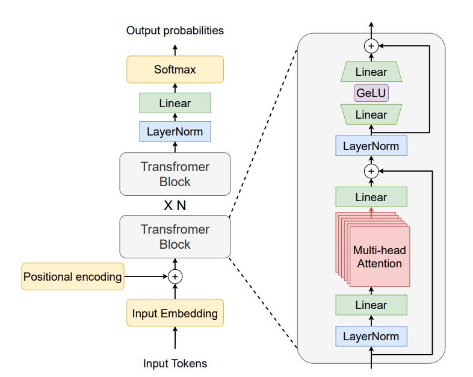
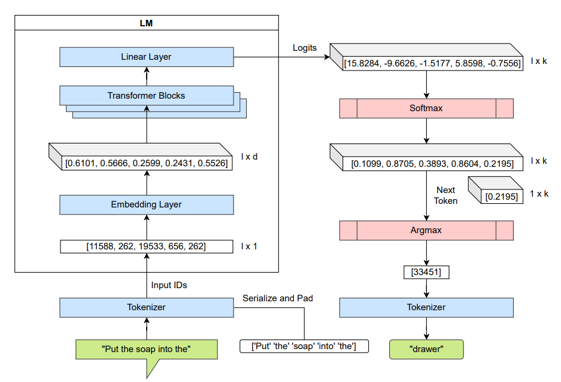
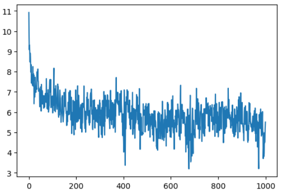
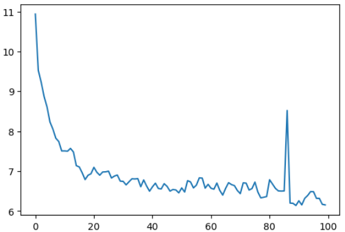
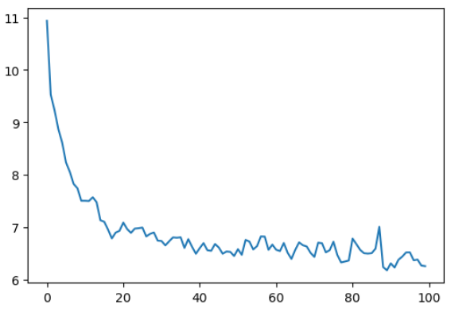
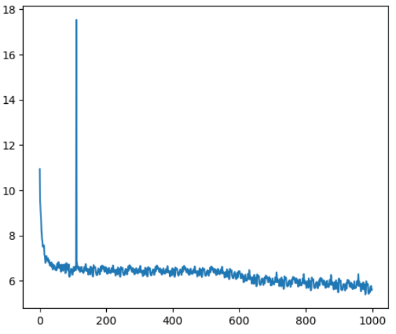

# gpt2-lite


A reproduction of GPT-2 from scratch. Includes the network architecture, optimized training pipeline and hyperparameters inspired by the GPT-2 and GPT-3 papers.


---

## GPT-2 Architecture
<p align="center">
  <br>
  <sub>Source: <a href="https://arxiv.org/pdf/2305.07716">arXiv:2305.07716</a></sub>
</p>

---

## GPT-2 Forward Pass
<p align="center">
  <br>
  <sub>Source: <a href="https://arxiv.org/pdf/2305.07716">arXiv:2305.07716</a></sub>
</p>


---
## GPT2 (small) Model Configuration
```
n_layer    = 12
n_head     = 12 
n_embd     = 768 
vocab_size = 50257 
block_size = 1024
```

---

## Inference Example (Hugging Face GPT-2 weights in custom model)

Prompt:
```
Hello World ! I'm LLM
```

Generated Output (sample): 5 sequences 32 max tokens
```
Hello World ! I'm LLM In ( is an no. The more 0 and you, at by the and for not the: of not 
Hello World ! I'm LLM, in... (.. The to a. : " , have the 1 as 
Hello World ! I'm LLM. 1 was ( (1. A " ( for The is on by from the of by that.. 
Hello World ! I'm LLM's " of in this and and- of, they have the the only a and that on as that all to on that 
Hello World ! I'm LLM was being the of the and on the you just, one (: the most I. It you have or a to
```


---


## Progress


### Step 1 

**Training Configuration**
- Max Iterations: 1000  
- Learning Rate: 3e-4  
- Batch Size: 32  
- Context Length (T): 8 


<table>
  <tr>
    <td valign="top" width="50%">
      <h4>Training Results</h4>
      <pre>
 0/1000    11.0011
100/1000   4.9416
200/1000   4.2336
300/1000   5.2082
400/1000   4.2915
500/1000   4.1871
600/1000   6.1562
700/1000   5.7454
800/1000   4.9037
900/1000   6.5263
      </pre>
    </td>
    <td valign="top" width="50%">
      <h4>Loss Curve</h4>
      
    </td>
  </tr>
</table>


---


### Step 2 

After model Initialization

**Training Configuration**
- Max Iterations: 1000  
- Learning Rate: 3e-4  
- Batch Size: 4  
- Context Length (T): 32


<table>
  <tr>
    <td valign="top" width="50%">
      <h4>Training Results</h4>
      <pre>
 0/1000   10.9186
100/1000   6.5374
200/1000   5.8276
300/1000   6.2550
400/1000   4.6903
500/1000   6.2554
600/1000   6.1157
700/1000   5.1208
800/1000   4.7785
900/1000   6.2280
      </pre>
    </td>
    <td valign="top" width="50%">
      <h4>Loss Curve</h4>
      
    </td>
  </tr>
</table>


---

## Optimize

### Step 3 

Automatic Mixed Precision (AMP)
PyTorch automatically picks the best precision (FP32, FP16, BF16) for each operation.

Train on T4 GPU (Google Colab free) :
Tesla T4 is based on Turing architecture, which supports FP32 and FP16, but not BF16.
PyTorch Inductor falls back to FP16/FP32 instead.

**Training Configuration**
- Max Iterations: 100  
- Learning Rate: 3e-4  
- Batch Size: 4  
- Context Length (T): 1024


<table>
  <tr>
    <td valign="top" width="50%">
      <h4>Training Results with FP32 not BF16</h4>
      <pre>
0/100   10.93682861328125     1616.471767425537 ms
10/100   7.506147384643555    1478.6090850830078 ms
20/100   7.094169616699219    1495.218276977539 ms
30/100   6.7423095703125      1506.7317485809326 ms
40/100   6.604820251464844    1517.301082611084 ms
50/100   6.578647613525391    1528.116226196289 ms
60/100   6.569816589355469    1536.2906455993652 ms
70/100   6.435047149658203    1549.015998840332 ms
80/100   6.783174514770508    1558.340072631836 ms
90/100   6.256216049194336    1558.7353706359863 ms

Time is for just one iteration
      </pre>
    </td>
    <td valign="top" width="50%">
      <h4>Loss Curve</h4>
      
    </td>
  </tr>
</table>


---
### Step 4 

#### FP16 Training & Gradient Scaling

##### Problem
- In **FP16** Training, gradients can be very small.  
- They may round to zero (**underflow**) → training becomes unstable.  

##### Solution → Gradient Scaling
- Multiply loss by a **scale factor** before backprop.  
- Makes gradients bigger → avoids underflow.  
- Scale back down before optimizer step.  

##### `torch.cuda.amp.GradScaler()`
- Prevents underflow in FP16.  
- Adjusts scale automatically.  
- Used with `torch.autocast` for mixed precision training.  


**Training Configuration**
- Max Iterations: 100  
- Learning Rate: 3e-4  
- Batch Size: 4  
- Context Length (T): 1024


<table>
  <tr>
    <td valign="top" width="50%">
      <h4>Training Results : FP16</h4>
      <pre>
0/100   10.936931610107422    2727.642774581909 ms
10/100   7.506355285644531    457.3230743408203 ms
20/100   7.090892314910889    461.38930320739746 ms
30/100   6.739969253540039    458.10413360595703 ms
40/100   6.603733062744141    461.1625671386719 ms
50/100   6.583924770355225    461.41934394836426 ms
60/100   6.57258939743042     465.5015468597412 ms
70/100   6.435788631439209    466.77279472351074 ms
80/100   6.785599708557129    464.48493003845215 ms
90/100   6.31415319442749     465.05022048950195 ms
      </pre>
    </td>
    <td valign="top" width="50%">
      <h4>Loss Curve</h4>
      
    </td>
  </tr>
</table>


---
### Step 5

#### torch.compile()
- Optimize the modle - works by capturing the computation graph → optimizing it → generating efficient kernels
- Reduces memory movement and speeds up training

**Training Configuration**
- Max Iterations: 1000  ** 
- Learning Rate: 3e-4  
- Batch Size: 4  
- Context Length (T): 1024


<table>
  <tr>
    <td valign="top" width="50%">
      <h4>Training Results</h4>
      <pre>
 0/1000   10.936920166015625    351.55177116394043 ms
100/1000   6.479531288146973    311.5057945251465 ms
200/1000   6.402681350708008    304.485559463501 ms
300/1000   6.378115653991699    304.52775955200195 ms
400/1000   6.456864356994629    305.42635917663574 ms
500/1000   6.316775321960449    304.31127548217773 ms
600/1000   6.322683334350586    312.0260238647461 ms
700/1000   6.105173110961914    310.18543243408203 ms
800/1000   5.920889377593994    313.4734630584717 ms
900/1000   6.097590446472168    309.53264236450195 ms

- Sudden spike normal in FP16 with GradScaler 
- Cause: gradient overflow → that optimizer step skipped & scale lowered 
- Loss looks high only for that step then training continues normally 
      </pre>
    </td>
    <td valign="top" width="50%">
      <h4>Loss Curve</h4>
      
    </td>
  </tr>
</table>


---


## References

- [Language Models are Unsupervised Multitask Learners (GPT-2 paper)](https://cdn.openai.com/better-language-models/language_models_are_unsupervised_multitask_learners.pdf)  
- [Language Models are Few-Shot Learners (GPT-3 paper)](https://arxiv.org/abs/2005.14165)
- [Automatic Mixed Precision - PyTorch](https://docs.pytorch.org/tutorials/recipes/recipes/amp_recipe.html)
