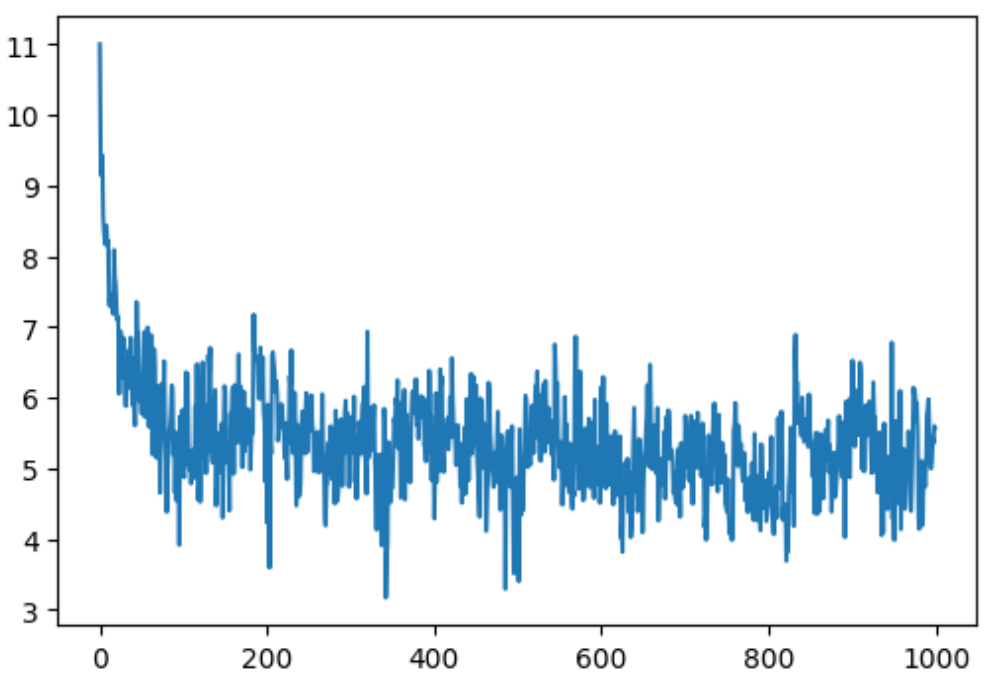
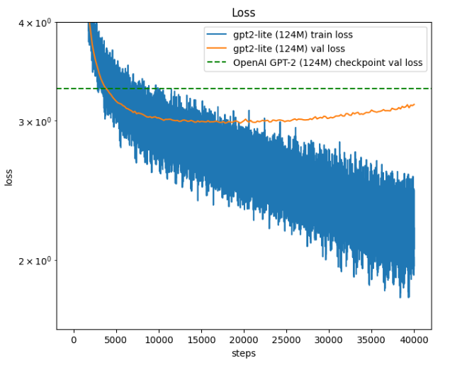

# gpt2-lite


A reproduction of GPT-2 from scratch. Includes the network architecture, optimized training pipeline and hyperparameters inspired by the GPT-2 and GPT-3 papers.


---

## GPT-2 Architecture
<p align="center">
  <br>
  <sub>Source: <a href="https://arxiv.org/pdf/2305.07716">arXiv:2305.07716</a></sub>
</p>

---

## GPT-2 Forward Pass
<p align="center">
  <br>
  <sub>Source: <a href="https://arxiv.org/pdf/2305.07716">arXiv:2305.07716</a></sub>
</p>


---
## GPT2 (small) Model Configuration
```
n_layer    = 12
n_head     = 12 
n_embd     = 768 
vocab_size = 50257 
block_size = 1024

Total #parameter tensors = 148
Total #parameters = 124475904  (~124M)
```

---

## Inference Example (Hugging Face GPT-2 weights in custom model)

Prompt:
```
Hello World ! I'm LLM
```

Generated Output (sample): 5 sequences 32 max tokens
```
Hello World ! I'm LLM In ( is an no. The more 0 and you, at by the and for not the: of not 
Hello World ! I'm LLM, in... (.. The to a. : " , have the 1 as 
Hello World ! I'm LLM. 1 was ( (1. A " ( for The is on by from the of by that.. 
Hello World ! I'm LLM's " of in this and and- of, they have the the only a and that on as that all to on that 
Hello World ! I'm LLM was being the of the and on the you just, one (: the most I. It you have or a to
```


---


## Progress


### Step 1 

**Training Configuration**
- Max Iterations: 1000  
- Learning Rate: 3e-4  
- Batch Size: 32  
- Context Length (T): 8 


<table>
  <tr>
    <td valign="top" width="50%">
      <h4>Training Results</h4>
      <pre>
 0/1000    11.0011
100/1000   4.9416
200/1000   4.2336
300/1000   5.2082
400/1000   4.2915
500/1000   4.1871
600/1000   6.1562
700/1000   5.7454
800/1000   4.9037
900/1000   6.5263
      </pre>
    </td>
    <td valign="top" width="50%">
      <h4>Loss Curve</h4>
      
    </td>
  </tr>
</table>


---


### Step 2 

After model Initialization

**Training Configuration**
- Max Iterations: 1000  
- Learning Rate: 3e-4  
- Batch Size: 4  
- Context Length (T): 32


<table>
  <tr>
    <td valign="top" width="50%">
      <h4>Training Results</h4>
      <pre>
 0/1000   10.9186
100/1000   6.5374
200/1000   5.8276
300/1000   6.2550
400/1000   4.6903
500/1000   6.2554
600/1000   6.1157
700/1000   5.1208
800/1000   4.7785
900/1000   6.2280
      </pre>
    </td>
    <td valign="top" width="50%">
      <h4>Loss Curve</h4>
      
    </td>
  </tr>
</table>


---

## Optimize

### Step 3 

Automatic Mixed Precision (AMP)
PyTorch automatically picks the best precision (FP32, FP16, BF16) for each operation.

Train on T4 GPU (Google Colab free) :
Tesla T4 is based on Turing architecture, which supports FP32 and FP16, but not BF16.
PyTorch Inductor falls back to FP16/FP32 instead.

**Training Configuration**
- Max Iterations: 100  
- Learning Rate: 3e-4  
- Batch Size: 4  
- Context Length (T): 1024


<table>
  <tr>
    <td valign="top" width="50%">
      <h4>Training Results with FP32 not BF16</h4>
      <pre>
0/100   10.93682861328125     1616.471767425537 ms
10/100   7.506147384643555    1478.6090850830078 ms
20/100   7.094169616699219    1495.218276977539 ms
30/100   6.7423095703125      1506.7317485809326 ms
40/100   6.604820251464844    1517.301082611084 ms
50/100   6.578647613525391    1528.116226196289 ms
60/100   6.569816589355469    1536.2906455993652 ms
70/100   6.435047149658203    1549.015998840332 ms
80/100   6.783174514770508    1558.340072631836 ms
90/100   6.256216049194336    1558.7353706359863 ms

Time is for just one iteration
      </pre>
    </td>
    <td valign="top" width="50%">
      <h4>Loss Curve</h4>
      
    </td>
  </tr>
</table>


---
### Step 4 

#### FP16 Training & Gradient Scaling

##### Problem
- In **FP16** Training, gradients can be very small.  
- They may round to zero (**underflow**) → training becomes unstable.  

##### Solution → Gradient Scaling
- Multiply loss by a **scale factor** before backprop.  
- Makes gradients bigger → avoids underflow.  
- Scale back down before optimizer step.  

##### `torch.cuda.amp.GradScaler()`
- Prevents underflow in FP16.  
- Adjusts scale automatically.  
- Used with `torch.autocast` for mixed precision training.  


**Training Configuration**
- Max Iterations: 100  
- Learning Rate: 3e-4  
- Batch Size: 4  
- Context Length (T): 1024


<table>
  <tr>
    <td valign="top" width="50%">
      <h4>Training Results : FP16</h4>
      <pre>
0/100   10.936931610107422    2727.642774581909 ms
10/100   7.506355285644531    457.3230743408203 ms
20/100   7.090892314910889    461.38930320739746 ms
30/100   6.739969253540039    458.10413360595703 ms
40/100   6.603733062744141    461.1625671386719 ms
50/100   6.583924770355225    461.41934394836426 ms
60/100   6.57258939743042     465.5015468597412 ms
70/100   6.435788631439209    466.77279472351074 ms
80/100   6.785599708557129    464.48493003845215 ms
90/100   6.31415319442749     465.05022048950195 ms
      </pre>
    </td>
    <td valign="top" width="50%">
      <h4>Loss Curve</h4>
      
    </td>
  </tr>
</table>


---
### Step 5

#### [torch.compile()](https://docs.pytorch.org/tutorials/intermediate/torch_compile_tutorial.html)
- Optimize the modle - works by capturing the computation graph → optimizing it → generating efficient kernels
- Reduces memory movement and speeds up training
- Speedup mainly comes from reducing Python overhead and GPU read/writes : Kernel Fusion

**Training Configuration**
- Max Iterations: 1000  ** 
- Learning Rate: 3e-4  
- Batch Size: 4  
- Context Length (T): 1024


<table>
  <tr>
    <td valign="top" width="50%">
      <h4>Training Results</h4>
      <pre>
 0/1000   10.936920166015625    351.55177116394043 ms
100/1000   6.479531288146973    311.5057945251465 ms
200/1000   6.402681350708008    304.485559463501 ms
300/1000   6.378115653991699    304.52775955200195 ms
400/1000   6.456864356994629    305.42635917663574 ms
500/1000   6.316775321960449    304.31127548217773 ms
600/1000   6.322683334350586    312.0260238647461 ms
700/1000   6.105173110961914    310.18543243408203 ms
800/1000   5.920889377593994    313.4734630584717 ms
900/1000   6.097590446472168    309.53264236450195 ms
      </pre>
      <p style="font-size:6px; color:#555; margin-top:8px;">
        <b>Note:</b> Sudden spike is normal in FP16 with GradScaler<br/>
        Cause: gradient overflow → that optimizer step skipped & scale lowered<br/>
        Loss looks high only for that step then training continues normally
      </p>
    </td>
    <td valign="top" width="50%">
      <h4>Loss Curve</h4>
      
    </td>
  </tr>
</table>


---
## Flash Attention
<p align="center">
  <br>
  <sub>Source: <a href="https://arxiv.org/pdf/2205.14135">arXiv:2205.14135</a></sub>
</p>

---
### Step 6

#### Flash Attention

**Training Configuration**
- Max Iterations: 1000  
- Learning Rate: 3e-4  
- Batch Size: 4  
- Context Length (T): 1024 


<table>
  <tr>
    <td valign="top" width="50%">
      <h4>Training Results with Flash Attention</h4>
      <pre>
 0/1000   11.04998779296875    29504.43410873413 ms
100/1000   6.266678333282471    224.99513626098633 ms
200/1000   5.910876274108887    228.49464416503906 ms
300/1000   5.714513778686523    230.88407516479492 ms
400/1000   5.469246864318848    239.96782302856445 ms
500/1000   5.182411193847656    242.69342422485352 ms
600/1000   5.377816677093506    248.34585189819336 ms
700/1000   5.327686309814453    249.58300590515137 ms
800/1000   5.103824615478516    243.99662017822266 ms
900/1000   5.353772163391113    243.64280700683594 ms
      </pre>
    </td>
    <td valign="top" width="50%">
      <h4>Loss Curve</h4>
      
    </td>
  </tr>
</table>

---
### Step 7

- Change AdamW hparams according to GPT-3 paper
- Use Gradient Clipping to avoid instability
- Gradient Clipping : Backprop → Compute total norm → If too big → Rescale → Optimizer step

**Training Configuration**
- Max Iterations: 1000  
- Learning Rate: 3e-4  
- Batch Size: 4  
- Context Length (T): 1024 


<table>
  <tr>
    <td valign="top" width="40%">
      <h4>Training Results with Gradient Clipping</h4>
      <pre>
0/1000     11.0500   28805.2113 ms   norm:3083477.0000
100/1000    6.6557     262.1136 ms   norm:27738.5840
200/1000    5.7117     265.0025 ms   norm:34191.1445
300/1000    5.4266     262.3129 ms   norm:36416.4805
400/1000    5.1001     262.0070 ms   norm:61068.4102
500/1000    4.6815     266.0735 ms   norm:52044.5430
600/1000    4.7866     262.3172 ms   norm:50558.5156
700/1000    4.8167     261.1341 ms   norm:61208.2344
800/1000    4.5307     269.9621 ms   norm:53956.7109
900/1000    4.7048     265.7101 ms   norm:59809.4688
      </pre>
      <p style="font-size:6px; color:#555; margin-top:8px;">
      Large initial norm is normal due to random initialization and small batch size</br>
      Without clipping: Optimizer steps can explode loss becomes NaN</br>
      With clipping: Gradients are rescaled to stay stable training becomes safer
      </p>
    </td>
    <td valign="top" width="60%">
      <h4>Loss Curve</h4>
      
      <h4>Norms</h4>
      
    </td>
  </tr>
</table>

---
### Step 8

- Learning Rate Schedule
- Warmup + Decay
- Linear warmup (ramp up to max_lr = 6e-4)
- Cosine decay (smoothly decays to min_lr = max_lr * 0.1 )


**Training Configuration**
- Max Iterations: 1000  
- Batch Size: 4  
- Context Length (T): 1024 


<table>
  <tr>
    <td valign="top" width="40%">
      <h4>Training Results with LR Schedule</h4>
      <pre>
0/1000  11.0500  31587.015 ms  norm:3083475.250  lr:1.2000e-05
100/1000  6.3045  273.0086 ms  norm:127163.6641  lr:5.9632e-04
200/1000  5.5345  272.9156 ms  norm:159696.4688  lr:5.6746e-04
300/1000  5.3184  296.1235 ms  norm:166981.0938  lr:5.1287e-04
400/1000  5.0724  283.6609 ms  norm:181526.6875  lr:4.3846e-04
500/1000  4.7149  280.0109 ms  norm:159570.0469  lr:3.5230e-04
600/1000  4.9071  283.3986 ms  norm:147432.3750  lr:2.6372e-04
700/1000  5.0193  284.6563 ms  norm:164736.5156  lr:1.8232e-04
800/1000  4.6939  285.3720 ms  norm:204243.5781  lr:1.1693e-04
900/1000  4.9968  288.0721 ms  norm:226479.4844  lr:7.4629e-05
      </pre>
      <h4>Learning Rates</h4>
      
      <p><strong>from LR Schedule:</strong></p>
      <ul>
        <li>Linear warmup : Stable start</li>
        <li>Fast learning early (high learning rate after warmup)</li>
        <li>Cosine decay : Ensures good convergence at the end</li>
      </ul>
    </td>
    <td valign="top" width="60%">
      <h4>Loss Curve</h4>
      
      <h4>Norms</h4>
      
    </td>
  </tr>
</table>

---
### Step 9

- Fused AdamW & Weight Decay
- Weight decay discourages large weights by adding a penalty term proportional to the squared magnitude of the weights.


**Training Configuration**
- Max Iterations: 1000  
- Batch Size: 4  
- Context Length (T): 1024 


<table>
  <tr>
    <td valign="top" width="40%">
      <h4>Training Results with Fused AdamW and Weight Decay</h4>
      <pre>
0/1000  11.0500  28093.091 ms  norm:3083478.50  lr:1.2000e-05
100/1000  6.4019  220.3937 ms  norm:14655.1631  lr:5.9632e-04
200/1000  5.6650  223.6030 ms  norm:2350.9248  lr:5.6746e-04
300/1000  5.5272  233.0117 ms  norm:3941.6348  lr:5.1287e-04
400/1000  5.2381  230.9189 ms  norm:3093.4365  lr:4.3846e-04
500/1000  4.8576  229.7168 ms  norm:2934.7229  lr:3.5230e-04
600/1000  4.9919  235.3790 ms  norm:2192.4456  lr:2.6372e-04
700/1000  5.0633  237.4313 ms  norm:2855.9104  lr:1.8232e-04
800/1000  4.7993  240.4399 ms  norm:5751.0132  lr:1.1693e-04
900/1000  5.0887  241.5686 ms  norm:2847.8865  lr:7.4629e-05
      </pre>
      <p><strong>from Weight Decay:</strong></p>
      <ul>
        <li>Prevents weights from becoming too large and Helps avoid overfitting</li>
        <li>Improves generalization on unseen data</li>
      </ul>
    </td>
    <td valign="top" width="60%">
      <h4>Loss Curve</h4>
      
    </td>
  </tr>
</table>

---
### Step 10

- Gradient Accumulation</br>
Split large batch into smaller micro batches </br>
Accumulate the gradients over multiple forward+backward passes</br>
Only update the weights after processing micro batches
 

**Training Configuration**
- Max Iterations       : 100 
- Total Batch size     : 65536 (2^16) ~65K
- Micro batch size (B) : 4     (2^2)
- Context Length (T)   : 1024  (2^10)
- Gradient Accu steps  : 16    (2^4) = (2^16) / (2^10)*(2^2)


<table>
  <tr>
    <td valign="top" width="40%">
      <h4>Training Results with Gradient Accumulation</h4>
      <pre>
0/100  11.0047  3792.5212 ms  norm:3022787.0000  lr:1.2000e-04
10/100  8.4386  3767.2260 ms  norm:192917.4531  lr:5.9632e-04
20/100  7.4238  3645.7593 ms  norm:68436.3281  lr:5.6746e-04
30/100  6.9540  3668.0806 ms  norm:41665.8750  lr:5.1287e-04
40/100  6.6860  3656.0788 ms  norm:38676.5469  lr:4.3846e-04
50/100  6.5474  3668.5312 ms  norm:35744.8555  lr:3.5230e-04
60/100  6.5093  3654.3462 ms  norm:34978.3359  lr:2.6372e-04
70/100  6.5029  3648.8955 ms  norm:27477.3652  lr:1.8232e-04
80/100  6.4956  3671.9394 ms  norm:18563.4082  lr:1.1693e-04
90/100  6.4972  3670.1610 ms  norm:17941.3672  lr:7.4629e-05
      </pre>
      <p><strong>from Gradient Accumulation:</strong></p>
      <ul>
        <li>Simulates larger batch size without more memory</li>
        <li>Stabilize but Slower training</li>
      </ul>
    </td>
    <td valign="top" width="60%">
      <h4>Loss Curve</h4>
      
    </td>
  </tr>
</table>

---

### Step 11

**Key Modifications**

- AMP with **bfloat16** : Support RTX 4080 
<py-script>
    with torch.autocast(device_type=device,dtype=torch.bfloat16):
        logits , loss = model(xb,yb)
</py-script>

- Removed gradient scaler
- Added Validation loop and Inference loop
- Checkpoint saved : x 10000

 

**Training Configuration**
- Hardware             : NVIDIA GeForce RTX 4080 16GB
- Duration             : ~6 hours
- Max Iterations       : 40000 
- 
- Dataset : **WikiText-100M**
- Total Batch size     : 65536 (2^16) ~65K
- Micro batch size (B) : 4     (2^2)
- Context Length (T)   : 1024  (2^10)
- Gradient Accu steps  : 16    (2^4) = (2^16) / (2^10)*(2^2)


<table>
  <tr>
    <td valign="top" width="50%">
      <h4>Training Results</h4>
        
      <p><strong>Final losses:</strong></p>
      <ul>
        <li>Train loss : 2.1933 </li>
        <li>Val loss   : 3.1442 </li>
      </ul>
    </td>
    <td valign="top" width="50%">
      <h4>Loss, Val curve</h4>
      
    </td>
    <p><strong>Min losses:</strong></p>
      <ul>
        <li>Min Train Loss      : 1.790882</li>
        <li>Min Validation Loss : 2.9785</li>
      </ul>
  </tr>
</table>


- Good training progress
- Overfitting after ~9K steps
- 
- Next : Early stopping, Dropout, ..

---


## References

- [Language Models are Unsupervised Multitask Learners (GPT-2 paper)](https://cdn.openai.com/better-language-models/language_models_are_unsupervised_multitask_learners.pdf)  
- [Language Models are Few-Shot Learners (GPT-3 paper)](https://arxiv.org/abs/2005.14165)
- [Automatic Mixed Precision - PyTorch](https://docs.pytorch.org/tutorials/recipes/recipes/amp_recipe.html)
- [torch.compile()](https://docs.pytorch.org/tutorials/intermediate/torch_compile_tutorial.html)
- [Flash Atttention](https://arxiv.org/pdf/2205.14135)
- [Flash Atttention-2](https://arxiv.org/pdf/2307.08691)


